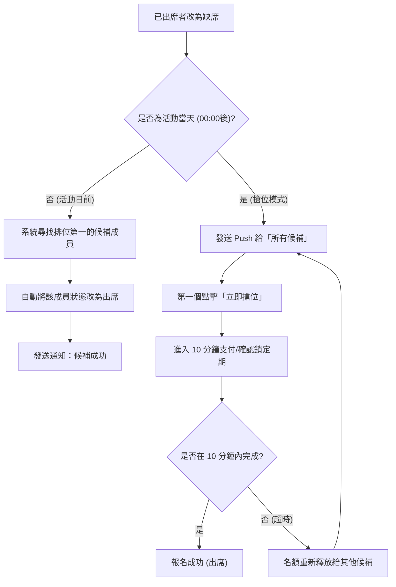

## 1. 競品分析與產品優勢 (Competitive Analysis)
在現今的業餘足球生態中，多數球隊依賴零散的工具來管理，這產生了極大的摩擦成本。以下為本平台 (TEAMSPIRIT) 與現有工具的對比：

| 競品 | 核心弱點 | TEAMSPIRIT (我們的優勢與差異化) |
|------|---------|-------------------------------|
| **WhatsApp Group** | 訊息容易洗版，名單需手動 Copy & Paste，無法追蹤誰沒交錢，完全沒有賽後數據紀錄。 | **全自動化引擎**：雙階段搶位候補機制、自動化名單管理與強制先付款後佔位，讓 Admin「零」文書工作。 |
| **Joyso** | 偏向純粹的約戰與尋找對手，對「單一球隊內部管理」與「長期的球員生涯數據」支援較弱。 | **強大內部管理與遊戲化**：專注於球隊內部向心力，提供類似 FIFA 的個人雷達圖、神射手排行榜與出席率追蹤。 |
| **Meetup** | 泛用型平台，缺乏足球專屬功能（如：排陣、進球紀錄），手續費高昂且不符合香港在地踢波文化。 | **深度在地化**：內建全港標準足球場資料庫、一鍵導航，並串接香港天文台提供撞波與雷暴預警。 |

## 2. 產品概述
一個專為業餘足球愛好者與球隊管理員設計的全端 SaaS 網頁應用程式。
- 旨在解決球隊報名、自動候補管理、賽後數據追蹤（進球、助攻、出席率等）以及球隊內部財務（隊費）管理的痛點，讓業餘足球隊運作更高效。
- 目標客群為各地的業餘足球隊長與球員，透過「免費槽位」、「Token 單次充值」與「Pro 月費訂閱」的混合商業模式創造營收。

## 3. 核心功能

### 3.1 用戶角色與權限矩陣 (Permission Matrix)
| 功能 / 角色 | Owner (創辦人) | Admin (管理員) | Member (成員) | Guest (訪客) |
|------------|---------------|----------------|--------------|--------------|
| **查看公開資訊** | ✅ | ✅ | ✅ | ✅ |
| **報名/出席活動** | ✅ | ✅ | ✅ | ❌ |
| **查看個人數據** | ✅ | ✅ | ✅ | ❌ |
| **發起/取消活動** | ✅ | ✅ | ❌ | ❌ |
| **填寫賽後數據** | ✅ | ✅ | ❌ | ❌ |
| **審批成員加入** | ✅ | ✅ | ❌ | ❌ |
| **踢除一般成員** | ✅ | ✅ | ❌ | ❌ |
| **踢除 Admin** | ✅ | ❌ | ❌ | ❌ |
| **設定/更改 Payout**| ✅ | ❌ | ❌ | ❌ |
| **處理退款** | ✅ | ❌ | ❌ | ❌ |
| **轉讓 Owner 身份**| ✅ | ❌ | ❌ | ❌ |
| **刪除球隊** | ✅ | ❌ | ❌ | ❌ |

### 3.2 功能模組
1. **首頁與儀表板**: 用戶所屬球隊列表、近期活動概覽、未讀通知小鈴鐺、個人本季數據摘要。
2. **球隊與槽位訂閱模組 (Pricing & Slots)**: 
   - **收費矩陣**:
     - 免費計劃 ($0): 永久 3 個槽位 (可加/可創)，適合偶爾踢波玩家。
     - Tokens 入門 ($20): 10 Tokens。
     - Tokens 超值 ($40): 25 Tokens。
     - Tokens 狂熱 ($60): 40 Tokens。
     - Pro 月費 ($78/月): 無限解鎖 (上限 20 隊) 且解鎖所有進階功能，適合多隊領隊。
   - **槽位消耗邏輯 (Slot System & Subscription Credits)**:
     - Token 定義為「Subscription Credits (訂閱點數)」，儲值後不過期（永久有效），但會根據用戶使用的功能按週期或次數自動扣除。
     - 每個用戶加入/創立球隊需佔用一個槽位。
     - **加入球隊**：扣除 1 Token / 30日（週期性自動續扣）。
     - **創立球隊**：扣除 2 Tokens / 30日（週期性自動續扣）。
     - **舉辦收費活動**（設定有報名費）：額外扣除 1 Token / 次。
     - 槽位跟人綁定，有效期內退出 A 隊改加 B 隊，不再額外扣除 Token。
     - *註：當 Token 餘額不足以支付下一週期扣款時，該用戶需 Token 之功能將暫停，但其在球隊內的資料會保留 30 日（寬限期）。*
3. **活動與候補模組 (The Engine)**: 發起比賽/練波、賽前自動提醒、活動取消/延期通知。
   - **雙階段候補機制 (Unique Feature)**:
     - **第一階段 (活動日前)**: 有人退出，系統按 Waiting List 序號自動遞補。
     - **第二階段 (活動當天 00:00 後 - 搶位模式)**: 進入搶位模式。有人退出時，發送 Push 給「所有候補」。第一個點擊「立即搶位」的人擁有 10 分鐘鎖定期，超時未付/未確認則名額釋放重新搶。
4. **智慧預警與整合**: 
   - **撞波預警**: 系統只根據用戶個人已報名的活動日曆進行時間衝突提醒，**絕對不會**向其他球隊或用戶披露跨球隊的活動內容，確保隱私。
   - **天氣整合**: 串接香港天文台 API，在活動卡片顯示地區天氣與「雷暴警告」。
   - **自動清理**: 90 天無活動且未續費的球隊自動歸檔，節省系統資源。
   - 踢除連動：成員被踢出後，系統自動取消其未來所有報名，並遞補空位。
5. **場地資料庫與導航模組 (Venue & Navigation)**:
   - **全港標準足球場資料庫**: 系統內建香港各大硬地/仿真草/真草足球場清單（包含地區、詳細地址與經緯度）。
   - **智能選場**: Admin 發起活動時只需下拉搜尋，不用再手打地址。
   - **一鍵導航**: 球員在活動詳情頁點擊場地，可直接開啟 Google Maps / Apple Maps 導航，徹底解決「今晚個場點去？」的痛點。
6. **強制繳費報名與混合支付模組 (Hybrid Payment & Payout)**:
   - **建立活動定價**: Admin 發起活動時可設定「報名費 (例如 $50)」。
   - **多階段支付方案 (Fallback Mechanism)**:
     - **Phase 1 (Stripe 信用卡/Apple/Google Pay)**: 先付費後佔位。點擊「出席」跳轉結帳，付款成功後狀態更新為 `ATTEND`。
     - **Phase 2 (手動 FPS 轉帳確認)**: Admin 可上傳自己轉數快 QR Code，球員點擊出席後上傳「入數截圖」，由 Admin 在系統後台「手動審批」為已付款 (ATTEND)。
     - **Phase 3 (PayMe for Business API)**: 待 API 支援後，串接直接一鍵付款。
   - **平台代收與抽成 (針對 Phase 1)**: 透過 Stripe 的金流，扣除平台手續費（例如 5%）後，將款項結算 (Payout) 給 Admin。
   - **退款機制**: 支援一鍵退款至球員信用卡。
7. **賽後數據與排行榜模組 (Match Stats & Leaderboard)**:
   - **比賽結果**: Admin 可在活動結束後輸入最終比數（例：3 - 1）。
   - **球員數據**: 針對出席該場比賽的成員，Admin 可標記個人的 **進球數 (Goals)**、**助攻數 (Assists)**、**黃牌 (Yellow Cards)** 與 **紅牌 (Red Cards)**。
   - **進階雷達圖 (Pro 專屬)**: Pro 球隊的成員能看到自己的能力雷達圖（綜合出勤、進球效率等），並保留終身歷史數據（免費版僅保留近 3 個月）。
8. **品牌客製化模組 (Pro 專屬 - Custom Branding)**:
   - Pro 版 Admin 可以上傳球隊專屬 Logo（取代預設頭像）。
   - 可自定義球隊頁面的「主題強調色 (Accent Color)」（例如：利物浦紅、車路士藍）。
   - 該球隊頁面上的所有廣告與「Powered by SQUAD」等系統浮水印將被移除，營造 100% 職業球會官網的體驗。

### 2.3 頁面詳情
| 頁面名稱 | 模組名稱 | 功能描述 |
|-----------|-------------|---------------------|
| Landing Page | 產品介紹 | 展示 SaaS 特色、價格方案 (Free/Pro)、登入/註冊入口 |
| 儀表板 (Dashboard) | 總覽模組 | 顯示即將到來的比賽、所屬球隊清單、個人賽後數據摘要 (Pro 版有雷達圖)、個人訂閱狀態 |
| 球隊詳情頁 | 成員與數據 | 顯示隊員列表、球隊歷史戰績、神射手/助攻王排行榜、Pro 專屬客製主題色與 Logo |
| 活動詳情頁 | 報名與賽後紀錄 | 賽前：出席/缺席/候補名單、Stripe 付款按鈕、退款管理。 賽後：比數看板、Admin 填寫進球助攻面板 |
| 付費訂閱頁 | Stripe 結帳 | 展示 Token 套餐 ($20/10, $40/25, $60/40) 與 Pro 月費 ($78/月)，引導至 Stripe 結帳。 |

## 3. 核心流程 (The Engine)
**雙階段候補機制流程 (Two-Stage Waitlist Workflow)**:

## 5. MVP Roadmap (開發分期計畫)

為了確保專案能盡早推向市場驗證，我們將開發時程分為四個階段 (Phase 1 ~ Phase 4)：

### Phase 1: 核心 MVP (第 1-2 個月)
- 用戶註冊與登入 (NextAuth)。
- 球隊的建立與加入 (包含 3 個免費槽位系統)。
- 活動的建立、報名與出席確認 (出席/缺席)。
- 基礎的候補機制 (FIFO 排隊)。
- 儀表板與球隊頁面的基礎展示。

### Phase 2: 商業化與引擎優化 (第 3-4 個月)
- 導入 Token (Subscription Credits) 購買系統與餘額消耗邏輯。
- **Stripe Connect 強制繳費報名** (先付款後佔位) 與平台抽成 Payout 結算機制。
- **雙階段候補搶位模式** (The Engine 核心)。
- 系統內部通知與 Email/Push 推播通知。

### Phase 3: 數據與在地化整合 (第 5-6 個月)
- 建立全港場地資料庫與下拉選單。
- 撞波預警系統 (個人日曆衝突比對)。
- 天氣 API (天文台) 整合顯示。
- 賽後數據填寫 (比數/進球/助攻/紅黃牌) 與基礎 Leaderboard。

### Phase 4: Pro 訂閱與進階功能 (第 7-9 個月)
- Pro 月費訂閱 ($78/月) 與無上限球隊管理。
- 進階賽後數據 (雷達圖分析、終身歷史數據)。
- 品牌客製化 (自訂 Logo、主題色、去廣告)。
- FPS 手動確認模式 (支付 Fallback)。
- Marketplace 進階金流結算報表 (Admin 財務報表匯出)。

## 6. 用戶介面設計
### 6.1 設計風格 (Design Style)
- **主視覺與配色**: 採用「運動科技風 (Sports Tech)」，以深色模式 (Dark Mode) 為基底，搭配高對比的螢光綠或活力橘作為強調色 (Accent color)，營造現代、活力的視覺感受。
- **按鈕與互動**: 報名按鈕採用明顯的狀態顏色（綠色=出席，紅色=缺席），點擊時帶有微動畫 (Micro-interactions) 提供明確的回饋感。
- **字體**: 標題使用動感強烈的無襯線字體（如 `Teko` 或 `Oswald`），內文使用易讀的 `Inter`。
- **排版**: 採用卡片式佈局 (Card-based)，圓角 `rounded-2xl`，配上細微的玻璃擬物化 (Glassmorphism) 背景，讓層次更分明。

### 6.2 頁面設計概覽
| 頁面名稱 | 模組名稱 | UI 元素 |
|-----------|-------------|-------------|
| 儀表板 | 近期活動卡片 | 日期醒目顯示、剩餘名額進度條、快速報名/請假按鈕 |
| 活動詳情 | 賽後紀錄面板 | 使用 Avatar 顯示頭像，Admin 可點擊 +/- 按鈕增加球員進球數、發送紅黃牌圖示 |

### 6.3 響應式設計 (Responsiveness)
- **Mobile-first**: 業餘球員 90% 以上會在球場或通勤時用手機回覆出席狀況與查看賽後數據，因此全站必須以手機端體驗為主（底部導覽列、大點擊範圍），再適配至桌面版。